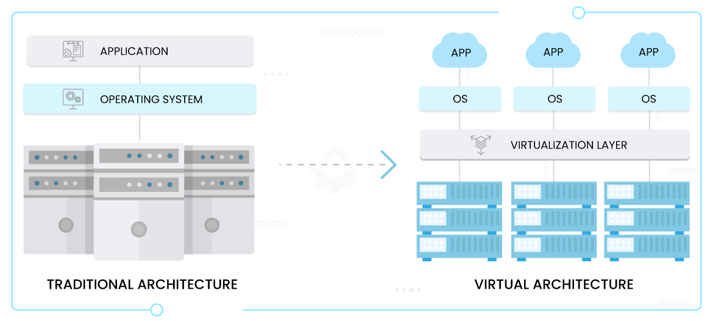
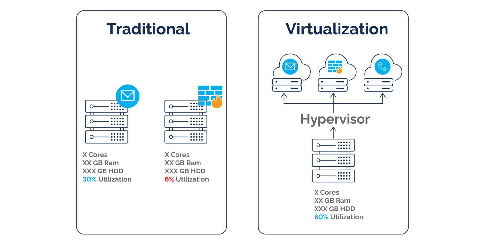
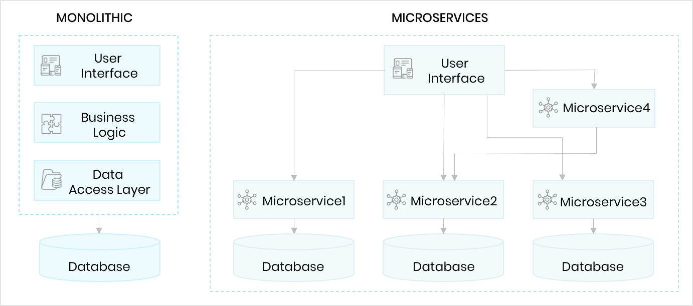

# Docker reaserch task 

## contents 

- [Docker reaserch task](#docker-reaserch-task)
  - [contents](#contents)
- [Differences between virtualisation and containerisation](#differences-between-virtualisation-and-containerisation)
  - [Virtualisation](#virtualisation)
  - [Containerisation](#containerisation)
    - [container vs virtual machine](#container-vs-virtual-machine)
- [Microservices](#microservices)
  - [What are they?](#what-are-they)
  - [How are they made possible?](#how-are-they-made-possible)
  - [Benefits](#benefits)
- [Docker](#docker)
  - [Alternatives](#alternatives)
  - [How it works (Docker architecture/API)](#how-it-works-docker-architectureapi)
    - [From docker docs:](#from-docker-docs)
  - [Success story using Docker](#success-story-using-docker)
          - [sources](#sources)

# Differences between virtualisation and containerisation
## Virtualisation 

Virtualisation is something that has come about due to the utilisation of virtual or cloud architecture in place of a traditional physical architecture. 
 
Virtualisation splits CPU, RAM and storage space between multiple VM's.  

 
This is achieved using a hypervisor, also known as a virtual machine monitor, which is a software that creates and runs virtual machines. A hypervisor allows one host computer to support multiple VMs, by splitting the resources mentioned above.
 
 
It should be noted that none of the individual VMs interact with one another, but they all benefit from the same hardware. 

## Containerisation 
Containerisation is a form of virtualisation. Virtualisation aims to run multiple OS instances on a single server, whereas containerization runs a single OS instance, with multiple user spaces to isolate processes from one another. This means containerization makes sense for one AWS cloud user that plans to run multiple processes simultaneously.
 
Containerisation is achieved by packaging software code, libraries, frameworks, and other dependencies together in an isolated user space called a container. This container is portable and can be used on any infrastructure in any environment that supports the container technology, such as Docker and Kubernetes.

### container vs virtual machine 
| Feature | Virtual Machine (VM) | Container |
|---|---|---|
| What it virtualizes | Entire physical machine (hardware and OS) | Application and its dependencies (only software layer above OS) |
| Operating System | Each VM has its own full OS | Shares the host operating system kernel |
| Resource Usage | High, as it runs a full OS | Low, as it shares host OS resources |
| Startup Time | Relatively slow | Very fast |
| Isolation | High, each VM is completely isolated | Moderate, shares host OS, potential security concerns |
| Portability | Can be less portable due to OS dependencies | Highly portable, runs on any system with compatible kernel |
| Best use cases | Legacy applications, diverse OS needs, development environments | Microservices, rapid deployment, cloud-native applications |

# Microservices

## What are they?
Microservice architectures involve decoupling the main components of an application into singular, isolated components. Since the components can operate independently of one another, it reduces the risk of errors or complete service outages.

## How are they made possible?
A container holds a single function for a specific task, or a microservice. By splitting each individual application function into a container, microservices improve enterprise service resilience and scalability.

## Benefits
Containerization also allows single application components to be updated in isolation, without affecting the rest of the technology stack. This ensures that security and feature updates are applied rapidly, with minimal disruption to overall operations.

# Docker
* free, open source platform used to build run and manage containerised applications 

## Alternatives
* Podman
* Buildah
* Kubernetes
* Vagrant
* Rancher Desktop
* VirtualBox
* Azure Container Registry
* OpenVZ
## How it works (Docker architecture/API)
* Packages software into containers that include code, libraries, and runtime 
* Allows developers to create, run, update, and manage applications 
* Makes it easy to deploy and scale applications into any environment 
* Works with development tools like VS Code, CircleCI, and GitHub 
### From docker docs: 
Docker uses a client-server architecture. The Docker client talks to the Docker daemon, which does the heavy lifting of building, running, and distributing your Docker containers. The Docker client and daemon can run on the same system, or you can connect a Docker client to a remote Docker daemon. The Docker client and daemon communicate using a REST API, over UNIX sockets or a network interface. Another Docker client is Docker Compose, that lets you work with applications consisting of a set of containers.
 

 

**Images**
 

An image is a read-only template with instructions for creating a Docker container. Often, an image is based on another image, with some additional customization. For example, you may build an image which is based on the ubuntu image, but installs the Apache web server and your application, as well as the configuration details needed to make your application run.
 
You might create your own images or you might only use those created by others and published in a registry. To build your own image, you create a Dockerfile with a simple syntax for defining the steps needed to create the image and run it. Each instruction in a Dockerfile creates a layer in the image. When you change the Dockerfile and rebuild the image, only those layers which have changed are rebuilt. This is part of what makes images so lightweight, small, and fast, when compared to other virtualization technologies.

## Success story using Docker
[docker success story](https://www.docker.com/customer-success/)
###### sources 
* [containerisation vs virtualisation](https://www.trianz.com/insights/containerization-vs-virtualization)
* [docker docs](https://docs.docker.com/get-started/docker-overview/)