# Tasks

- [Tasks](#tasks)
- [Task: Run and pull your first image](#task-run-and-pull-your-first-image)
- [Task: Run nginx web server in a Docker container](#task-run-nginx-web-server-in-a-docker-container)
- [Task: Remove a container](#task-remove-a-container)
- [Task: Modify our nginx default page in our running container](#task-modify-our-nginx-default-page-in-our-running-container)
- [Task: Run a different container on different port](#task-run-a-different-container-on-different-port)
- [Task: Push host-custom-static-webpage container image to Docker Hub](#task-push-host-custom-static-webpage-container-image-to-docker-hub)
- [Use the official Nginx image as a base](#use-the-official-nginx-image-as-a-base)
- [Remove the default Nginx index.html](#remove-the-default-nginx-indexhtml)
- [Copy the custom index.html into the Nginx web root](#copy-the-custom-indexhtml-into-the-nginx-web-root)

# Task: Run and pull your first image 

1. Open a terminal 

2. Get help from the docker command `docker --help`

    ```
    Usage:  docker [OPTIONS] COMMAND

    A self-sufficient runtime for containers

    Common Commands:
    run         Create and run a new container from an image
    exec        Execute a command in a running container
    ps          List containers
    build       Build an image from a Dockerfile
    pull        Download an image from a registry
    push        Upload an image to a registry
    images      List images
    login       Authenticate to a registry
    logout      Log out from a registry
    search      Search Docker Hub for images
    version     Show the Docker version information
    info        Display system-wide information

    Management Commands:
    ai*         Ask Gordon - Docker Agent
    builder     Manage builds
    buildx*     Docker Buildx
    compose*    Docker Compose
    container   Manage containers
    context     Manage contexts
    debug*      Get a shell into any image or container
    desktop*    Docker Desktop commands (Beta)
    dev*        Docker Dev Environments
    extension*  Manages Docker extensions
    feedback*   Provide feedback, right in your terminal!
    image       Manage images
    init*       Creates Docker-related starter files for your project
    manifest    Manage Docker image manifests and manifest lists
    network     Manage networks
    plugin      Manage plugins
    sbom*       View the packaged-based Software Bill Of Materials (SBOM) for an image
    scout*      Docker Scout
    system      Manage Docker
    trust       Manage trust on Docker images
    volume      Manage volumes

    Swarm Commands:
    swarm       Manage Swarm

    Commands:
    attach      Attach local standard input, output, and error streams to a running container
    commit      Create a new image from a container's changes
    cp          Copy files/folders between a container and the local filesystem
    create      Create a new container
    diff        Inspect changes to files or directories on a container's filesystem
    events      Get real time events from the server
    export      Export a container's filesystem as a tar archive
    history     Show the history of an image
    import      Import the contents from a tarball to create a filesystem image
    inspect     Return low-level information on Docker objects
    kill        Kill one or more running containers
    load        Load an image from a tar archive or STDIN
    logs        Fetch the logs of a container
    pause       Pause all processes within one or more containers
    port        List port mappings or a specific mapping for the container
    rename      Rename a container
    restart     Restart one or more containers
    rm          Remove one or more containers
    rmi         Remove one or more images
    save        Save one or more images to a tar archive (streamed to STDOUT by default)
    start       Start one or more stopped containers
    stats       Display a live stream of container(s) resource usage statistics
    stop        Stop one or more running containers
    tag         Create a tag TARGET_IMAGE that refers to SOURCE_IMAGE
    top         Display the running processes of a container
    unpause     Unpause all processes within one or more containers
    update      Update configuration of one or more containers
    wait        Block until one or more containers stop, then print their exit codes

    Global Options:
        --config string      Location of client config files (default
                            "/home/emily/.docker")
    -c, --context string     Name of the context to use to connect to the
                            daemon (overrides DOCKER_HOST env var and
                            default context set with "docker context use")
    -D, --debug              Enable debug mode
    -H, --host list          Daemon socket to connect to
    -l, --log-level string   Set the logging level ("debug", "info",
                            "warn", "error", "fatal") (default "info")
        --tls                Use TLS; implied by --tlsverify
        --tlscacert string   Trust certs signed only by this CA (default
                            "/home/emily/.docker/ca.pem")
        --tlscert string     Path to TLS certificate file (default
                            "/home/emily/.docker/cert.pem")
        --tlskey string      Path to TLS key file (default
                            "/home/emily/.docker/key.pem")
        --tlsverify          Use TLS and verify the remote
    -v, --version            Print version information and quit

    Run 'docker COMMAND --help' for more information on a command.

    For more help on how to use Docker, head to https://docs.docker.com/go/guides/
    ``` 
3. Workout the docker command to show all Docker images you already have on your local machine, then run it `docker images`
   * output shows no images are downloaded 
   ```
   REPOSITORY   TAG       IMAGE ID   CREATED   SIZE
   ``` 

4. Run your first Docker container using the `hello-world` image 
    * download hello-world <br>
    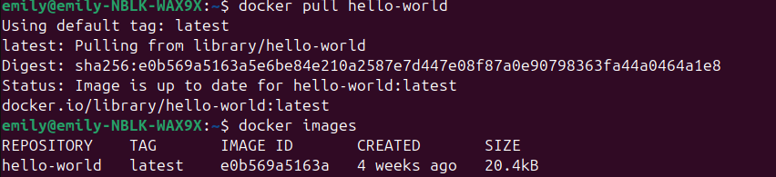
    * run hello world <br>
    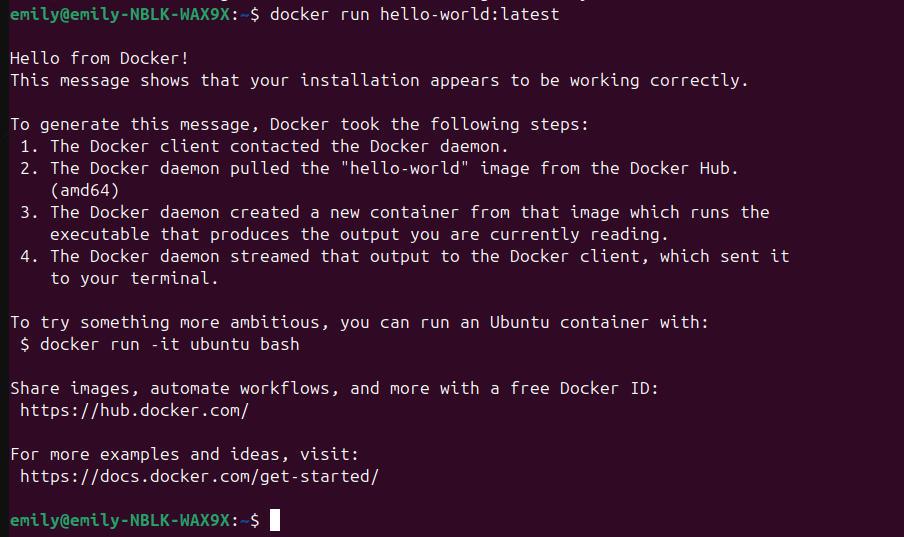

5. Re-run the command and notice the difference. Does the image need to be downloaded again when the command is run a second time? Document what happens when you run a docker image that does vs does not already exist on your local machine.
    * runs exactly the same, image only needs to be downloaded once 

# Task: Run nginx web server in a Docker container

1. Open a terminal 

2. Download the latest nginx Docker image using a docker command
   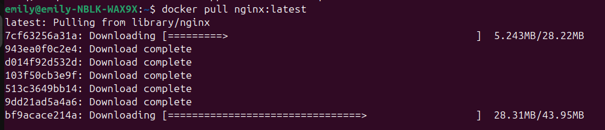

3. Run it so that it exposes it the running container on port 80 on your local machine
   `docker run -d -p 80:80 nginx:latest`
   * -d runs the container in detached mode (in the background).
   * -p 80:80 maps port 80 on your local machine to port 80 on the container, making the web server accessible via http://localhost:80 or http://<your-machine-ip>:80.
    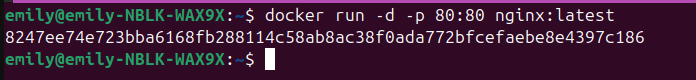

4. Run a Docker command to check if it’s running
    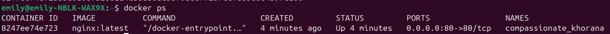
5. Check it’s working by going to localhost or 127.0.0.1 in your web browser
    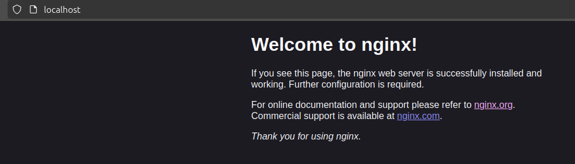

6. Stop the container running
   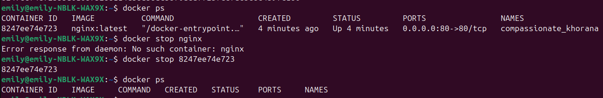


# Task: Remove a container

1. Open a terminal 

2. Re-start the nginx container you were previously running `docker restart nginx-container-name`
   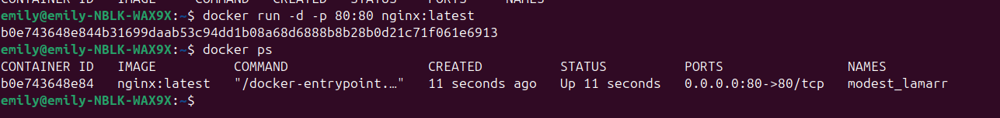

3. While the nginx container is running, try to remove the container – take note of the error
    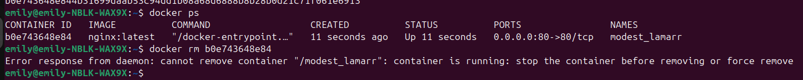
4. Work out the switch/option that you need to use so that you can forcibly remove a container which running
5. Run the docker command to check whether the container is still there `docker ps -a` 
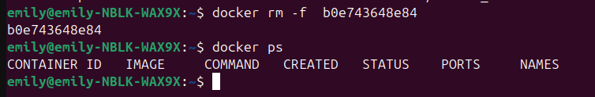

# Task: Modify our nginx default page in our running container

1. Re-run the nginx container exposed on port 80 of your local machine

2. Check the default webpage of the container in your web browser and keep it open for later

3. Access the shell of the nginx container that is running
   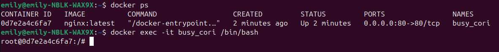

4. If you get an error, about “TTY”, work out how to run an `alias` command to make sure that every time you run the docker command it will be prefixed with `winpty`
   * N/A

5. Once you’ve logged into the shell of the nginx container, do an update & upgrade
   `apt-get update && apt-get upgrade -y`

6. Try to run `sudo` - notice the problem, then install sudo to fix it
                                   
    ```
    apt-get install sudo -y
    ```                                 

7. Check your present working directory, then navigate to where the default nginx file is kept
   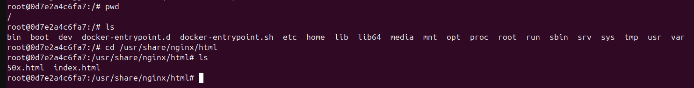

8. Use nano to edit index.html – notice the problem, then fix it so you can use nano
    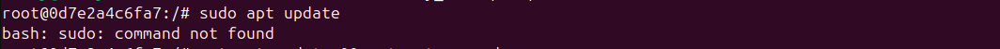
    ```
    apt-get install sudo -y
    ```      

9.  Once nano works, modify the HTML of the file so that instead of “Welcome to nginx!” the home page will be “Welcome to the Tech xxx Dreamteam!” – save your changes
    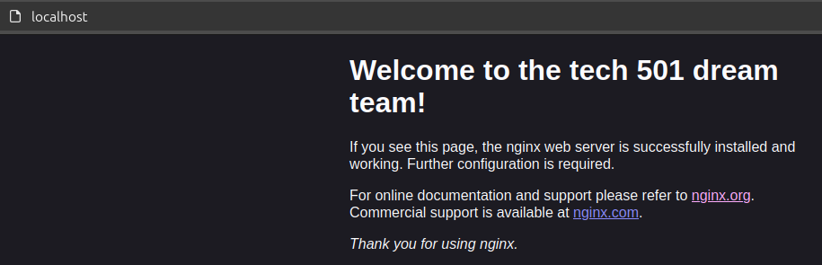

# Task: Run a different container on different port

1. Carrying on from the last task, you should already have running the nginx container that you modified

2. Try to run another container exposed on port 80 on your local machine (connect to port 80 inside the container) – here is the endpoint for the image to use: daraymonsta/nginx-257:dreamteam
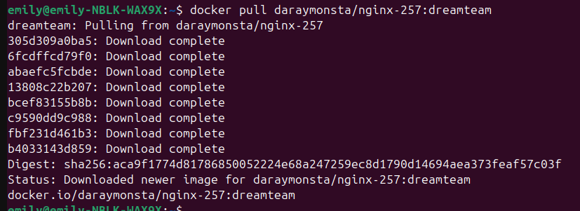
3. Document the error and why it occurs
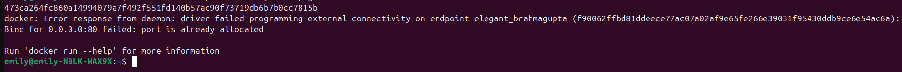
4. Remove the container we tried to run but couldn’t

5. Try to run the container from step 2 again but this time expose it on your local machine on port 90. Check this container is running in your web browser at `localhost:90` 
   
   ```
   docker run -d -p 90:80 daraymonsta/nginx-257:dreamteam 
   ```
    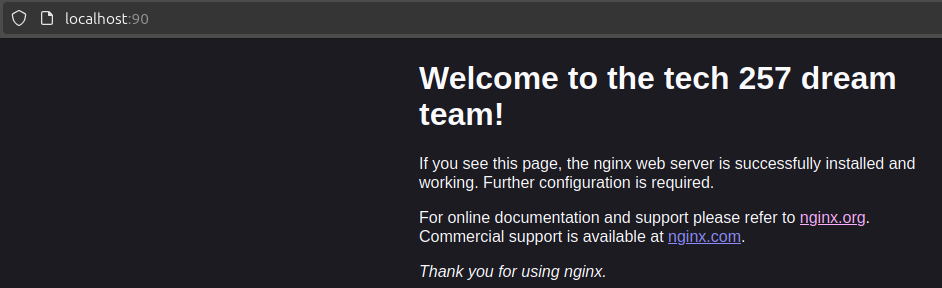


# Task: Push host-custom-static-webpage container image to Docker Hub

1. Create an image from your running container which is running nginx with the index.html file we already modified earlier
   ```
   docker commit upbeat_mestorf your-username/nginx-dreamteam:latest
   ``` 

2. Push the image to your Docker Hub account <br>
    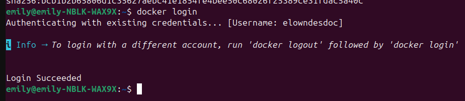
    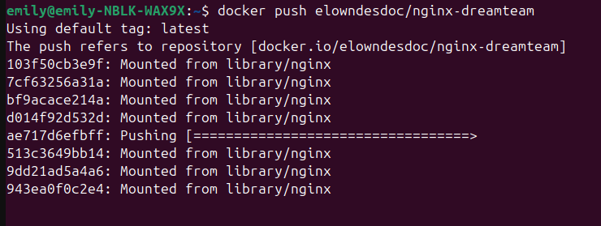
   ```
   docker login
   docker push your-username/nginx-dreamteam:latest

   ``` 
    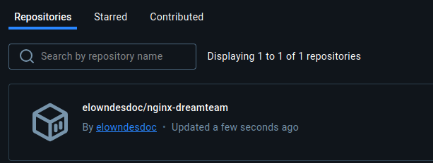
3. Use a docker command to run the container which uses your pushed container image. The container image referenced should contain your username on Docker Hub. 
   ```
   docker run -d -p 80:80 your-username/nginx-dreamteam:latest
    ``` 

# Task: Automate docker image creation using a Dockerfile

Rationale: We don't want to do the steps manually to change the default nginx page. We want to automate it.

1. Create a new folder such as techxxx-mod-nginx-dockerfile (not in a repo that will be published)

2. `cd` into the new folder

3. Create an index.html you'd like to use instead of the nginx default page

4. Create a Dockerfile to:

   1. Use the nginx base image

   2. Copy your index.html to the location of the nginx default page in the container

   3. Use a docker build command to build your custom image

```
# Use the official Nginx image as a base
FROM nginx:latest

# Remove the default Nginx index.html
RUN rm /usr/share/nginx/html/index.html

# Copy the custom index.html into the Nginx web root
COPY index.html /usr/share/nginx/html/index.html
``` 

o Tag it similar to techxxx-nginx-auto:v1

1. Run the container

2. Push your custom image to Docker Hub
   ****** start here! 

3. Use a docker command to run the container with uses your pushed custom image

4. Remove the local copy of your custom image

5.  Re-run your container and force docker to pull the custom image from Docker Hub 